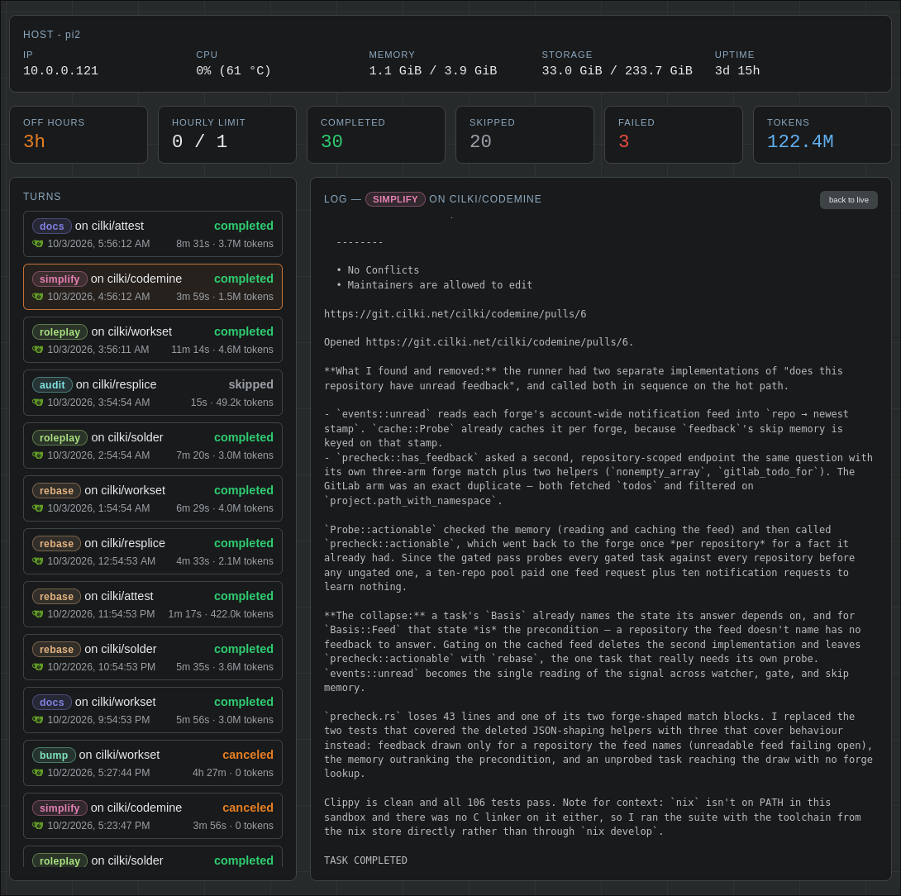

<p align="center">
	
</p>


<hr>

**codemine** runs AI agents on git repos while you're away, delivering tested
PRs and helpful issues.



Each "turn" does one of the following on a repo:

- `feedback`: responds to reviewer comments on its open PRs, and opens a PR for
  an issue it's assigned.
- `rebase`: rebases its own open PR branches that have merge conflicts with
  their base branch, resolving the conflicts and force-pushing.
- `bump`: update dependencies, handling any migration issues.
- `simplify`: remove dead code, simplify implementations, drop trivial tests.
- `todo`: implement TODOs in the repo.
- `roleplay`: run the project like a user would, fixing what breaks along the
  way.
- `benchmark`: run the project like a user would, searching for performance
  improvements.
- `audit`: evaluate the security of the project.
- `docs`: fix outdated docs.
- `coverage`: improve test coverage.
- `mutation`: mutate load-bearing code to find gaps the test suite misses.
- `feature`: propose a new feature as an issue, leaving the call to you rather
  than implementing it.
- `lint`: fix any results thrown by common linters.

### Motivation

I wanted an asynchronous process that uses some of my spare tokens to regularly
clean up the code I'm generating "in the foreground". Originally I tried
openclaw, but I found the messaging system unwieldly and annoying. I just want
to check my open PRs once a day, merge anything I think is ready and comment
feedback when the AI is going in the wrong direction.

Further, I wanted a simple web interface that I could use to adjust rate limits
and decide what types of tasks the AI should work on.

I'm running **codemine** on a Raspberry Pi 5 (onboard SSD rather than SD card)
to great success. I tried lesser hardware, but it often became unresponsive
during `cargo test`, `nix-shell`, etc. The pi can only reach my private gitea
instance which I mirror to Github.

### Getting started

The agent is confined with [Landlock](https://landlock.io) and a turn fails
rather than running it unconfined, so **codemine** needs a Linux 5.19 or newer
kernel (Landlock ABI 2 — anything older cannot allow the cross-directory
renames git performs constantly). In a container it is the host's kernel that
has to provide this, and the container's seccomp policy has to let the
`landlock_*` syscalls through.

Build the image and bring it up with the workspace on a volume; everything that
must survive the container — settings, repo clones, the proxy login — lives
there:

```sh
docker build -t codemine .
docker run -d --name codemine \
  -p 8080:8080 \
  -p 127.0.0.1:54545:54545 \
  -v codemine:/workspace \
  codemine
```

The container starts [CLIProxyAPI](#cliproxyapi) alongside **codemine**. Log in
to your AI provider once; the tokens persist on the volume and refresh on their
own from then on:

```sh
docker exec -it codemine cliproxyapi \
  -config /workspace/cliproxyapi/config.yaml -claude-login -no-browser
```

Open the URL it prints in your browser and approve the login. The OAuth callback
lands on port 54545, which is why `docker run` publishes it (loopback only)
above.

Then open http://localhost:8080 and finish up in the settings: pick a model, add
a forge token, and enable some repositories.

Everything but the three command-line options is configured there and persisted
in the workspace:

```
usage: codemine [--listen ADDR] [--workspace DIR] [--once]

  --listen ADDR     bind address for the web UI (default 0.0.0.0:8080)
  --workspace DIR   persistent workspace root (default ~/.codemine)
  --once            run a single turn and exit
  --help            show this help
```

The entrypoint already passes `--workspace /workspace`, and arguments given
after the image name reach **codemine** and override it, so appending `--once`
to the `docker run` above runs a single turn and exits.

### Features

#### CLIProxyAPI

Agents are routed through
[CLIProxyAPI](https://github.com/router-for-me/CLIProxyAPI), which manages the
model subscription. The Docker image runs the proxy itself and the default
settings already point at it (`http://127.0.0.1:8317`); elsewhere, point the
settings page at your own instance. Until the proxy answers, **codemine** stays
unconfigured and runs no turns.

#### Sandboxing

The agent runs under a Landlock ruleset that only lets it write to the clone it
was assigned, that turn's log, and the state directories of the tools it runs
(`~/.cargo`, `~/.npm`, the XDG directories, `/tmp`, `/nix`). It therefore
cannot work from some other checkout it finds on the machine. Reads stay
unrestricted: the agent needs toolchains and configs from all over, and the
damage vector is writing where it shouldn't.

#### Codegraph

With [codegraph](https://github.com/colbymchenry/codegraph) installed, the agent
avoids rereading the tree every turn, which cuts token usage substantially on
large projects. The Docker image ships it; elsewhere the runner skips indexing
when the CLI is absent and the agent explores the tree normally.

#### RTK

With [rtk](https://github.com/rtk-ai/rtk) installed, the agent's shell commands
are compressed to save tokens. It is optional even in the image, since the
pinned nixpkgs doesn't always carry it.

#### Scheduling and rate limiting

With a schedule enabled, turns can only _start_ inside a daily window; one
already under way is left to finish. The hourly limit counts the turns that
reported getting something done — a turn that found nothing to do and skipped
is free. It is spent from a bucket holding an hour's worth, so the limit can be
fractional (0.5 is one task every two hours) and an hour's worth can run back
to back.

#### Multiple forge support

**codemine** works with Gitea, GitHub, and GitLab. Add an access token and
select what repos **codemine** is enabled for (none by default). GitHub and
GitLab default to the public instances; Gitea has no default one, so it needs
the URL of yours as well as the token.

#### Web interface

You can view and manage the **codemine** instance via a simple web UI on
port 8080. This is where you configure your forge settings, rate limits, select
a model, choose what task types are run, view agent logs, etc.
